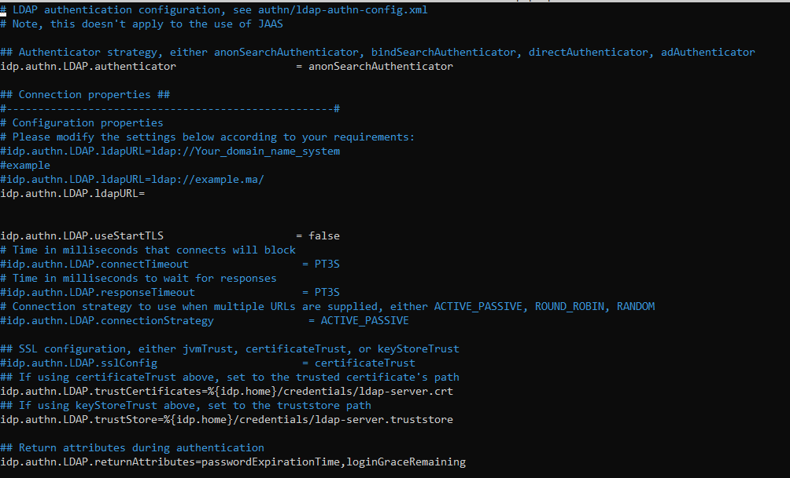
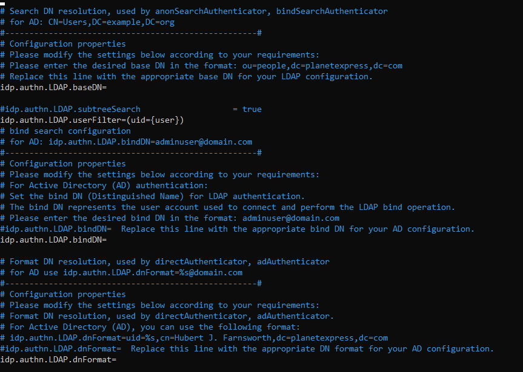
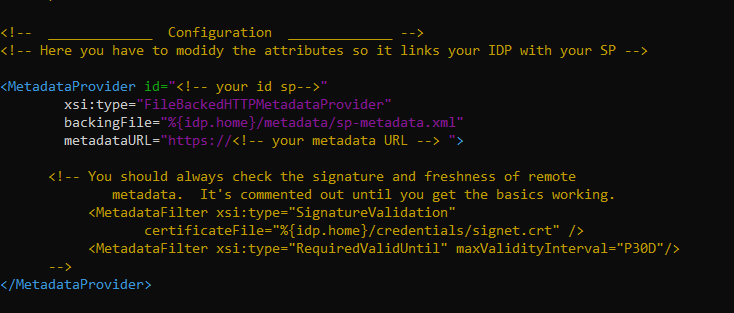
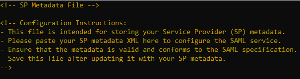
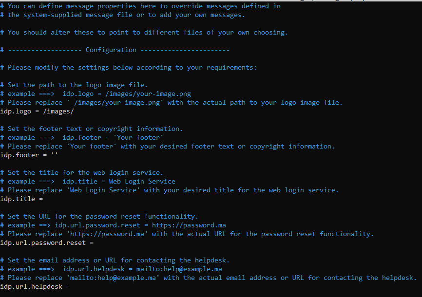

<h1>shibboleth-idp</h1>
<h1>Welcome to the configuration guide</h1>
 <h1>Requirements</h1>
 <ul>
   <li>docker</li>
   <li>docker compose</li>
   <li>Ldap server</li>
   <li>service provider</li>
 </ul>

<h1>Configuration</h1>
<h3>Please modify the settings below according to your requirements: </h3>
<h3>list files that you have to modify </h3>

<ul>
  <li><h1> config/shib-idp/conf/idp.properties </h1></li>
  <h3> This file contains the configuration settings for the Shibboleth Identity Provider (IDP). It includes properties such as the entity ID, metadata locations, encryption settings, and more. You need to modify this file to customize the IDP according to your requirements. Here's an example of the idp.properties file:  </h3>
  
  <li> <h1>config/shib-idp/conf/ldap.properties </h1></li>
 <h3> This file contains the configuration settings for the LDAP server used for authentication and attribute retrieval. It includes properties such as the LDAP server URL, credentials, and attribute mappings. You need to modify this file with the appropriate LDAP server details to enable the IDP to communicate with the LDAP server. Here's an example of the ldap.properties file:  </h3>
  
     
  <li> <h1> config/shib-idp/conf/metadata-providers.xml </h1></li>
 <h3> This file defines the metadata providers for the IDP, specifying where to retrieve metadata about Service Providers (SPs). It includes properties such as metadata URLs and certificate authorities. You may need to modify this file to add or update metadata providers based on your SP configurations. Here's an example of the metadata-providers.xml file:  </h3>
  
  <li> <h1> config/shib-idp/metadata/sp-metadata.xml </h1></li>
 <h3> This file contains the metadata for your Service Provider(s). It includes information such as the entity ID, signing certificates, and attribute mappings. You need to update this file with the metadata specific to your SP(s). Here's an example of the sp-metadata.xml file:  </h3>
  
  <li> <h1> messages/messages.properties </h1> </li>
 <h3> This file contains the messages and localization settings used by the IDP's web interface. It includes properties such as the CSS file path, logo path, footer message, title, password reset URL, and helpdesk email. You can modify this file to customize the appearance and messaging of the IDP. Here's an example of the messages.properties file:  </h3>
 
</ul>
