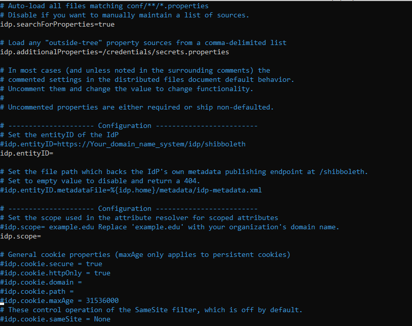

<h1>shibboleth-idp</h1>
<h1>Welcome to the configuration guide</h1>
 <h1>Requirements</h1>
 <ul>
   <li>docker</li>
   <li>docker compose</li>
   <li>Ldap server</li>
   <li>service provider</li>
 </ul>

<h1>Configuration</h1>
<h3>Please modify the settings below according to your requirements: </h3>
<h3>list files that you have to modify </h3>

<ul>
  <li>config/shib-idp/conf/idp.properties</li>
  
  <li>config/shib-idp/conf/ldap.properties</li>
  
     
  <li>config/shib-idp/conf/metadata-providers.xml</li>
  
  <li>config/shib-idp/metadata/sp-metadata.xml</li>
  
  <li>messages/messages.properties</li>
 
</ul>
